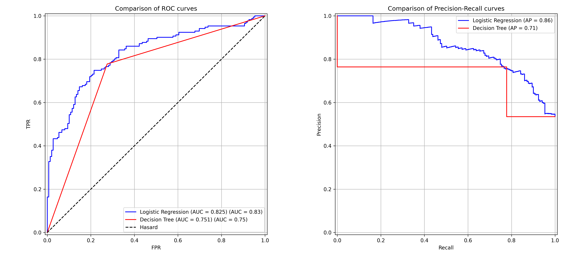

# ai-intern-week02
Second week of the AI Engineering internship learning plan

# Wine Quality Classifier

This repository contains a complete binary classification pipeline to predict whether a red wine is "good" or "poor" based on its chemical properties.

## Dataset
* **Source:** UCI Machine Learning Repository (Red Wine Quality)
* **Size:** 1,599 samples, 11 numerical features, 0 missing values.
* **Target Engineering:** The original `quality` score (3 to 8) was binarized:
  * `1` (Good wine): Quality $\ge 6$
  * `0` (Poor wine): Quality $< 6$

## Best Model
The **Logistic Regression** model is selected as the best choice. While the Decision Tree scored slightly better on a single split, the Logistic Regression model demonstrated significantly higher stability, lower variance, and a much better average performance across validation folds.

## Metrics Table

| Model | Single Split F1-Score (Class 1) | 5-Fold CV Mean F1-Score | 5-Fold CV Variance (Std) |
| :--- | :---: | :---: | :---: |
| **Logistic Regression** | 0.76 | **0.742** | **0.049** |
| **Decision Tree** | **0.77** | 0.651 | 0.075 |

### Key Takeaways from the Curves:
* **Threshold Flexibility:** The Logistic Regression curve (blue) is smooth, meaning its threshold can be finely tuned to balance Precision and Recall depending on constraints. The Decision Tree (red) shows a rigid step-like behavior, offering no flexibility.
* **ROC Curve & AUC:** Logistic Regression is slightly better at distinguishing good wines from bad ones with an **AUC of 0.825** compared to the Decision Tree's 0.751.
* **Precision-Recall:** Logistic Regression maintains a high precision (~95%) even when capturing up to 40% of the good wines, whereas the Decision Tree's precision drops instantly.

## Key Learnings
* **Decision Trees are prone to high variance:** Without hyperparameter tuning (like `max_depth`), trees easily overfit the training data.
* **Cross-Validation is paramount:** It is a reliable way to measure a model's true performance and ability to generalize to unseen data.
* **Unit Testing in ML:** Implementing a `pytest` suite ensuring that `model.predict()` returns the exact expected shape (`(N,)`) adds a layer of software quality before deployment.